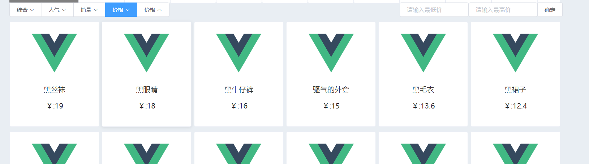
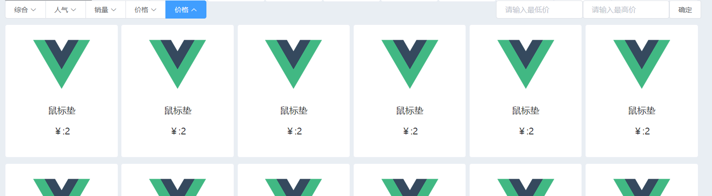
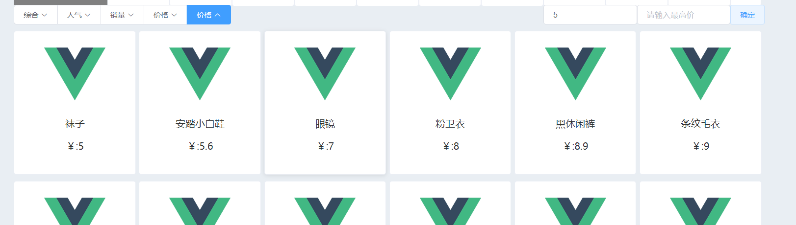
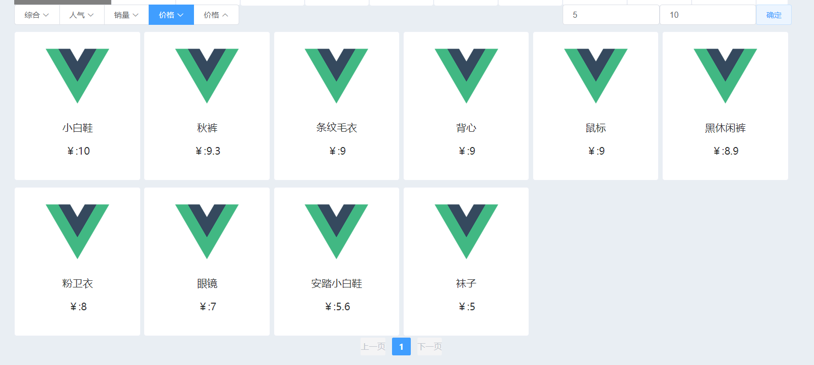
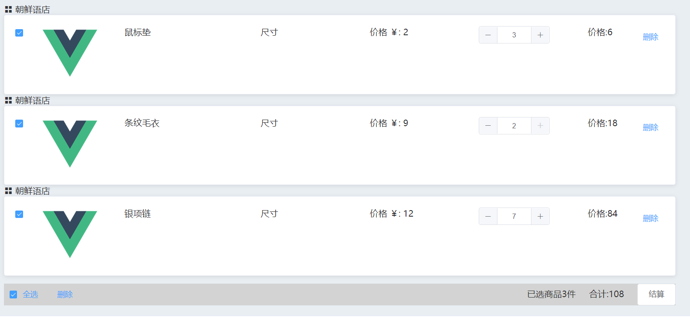
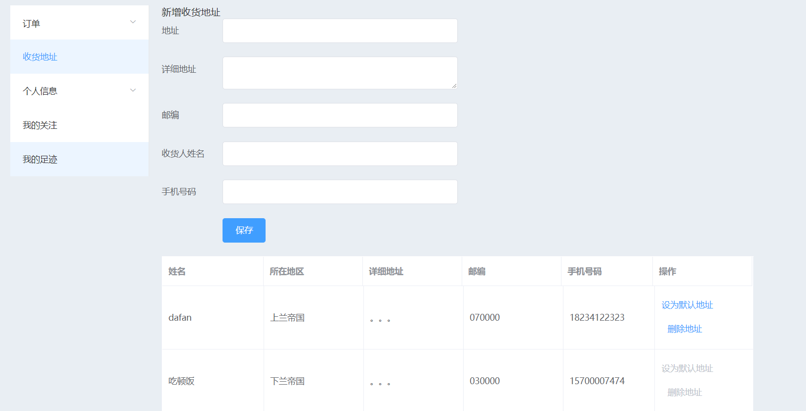

# a shop web with go(beego) and vue(element-ui)

---

[中文描述](https://c-dafan.github.io/04/05/shop-go-vue/)

## preview

根据价格排序


根据最高最低价筛选


购物车


地址管理



## how to create database and table

the file named fmyshop.sql is used to create database and tables.

```bash
mysql
mysql> source myshop.sql
```

## how to run

run beego

``` bash
cd ./myshop
bee run
```

run vue

```bash
cd ./shop
npm install
npm run dev
```

## how to enter the homepage

http://localhost:8080/

## Description

This site has a small number of bugs and part of it has not been finished.
